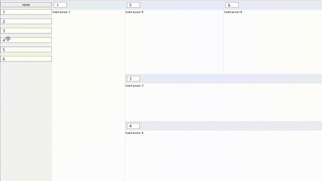

# React-Drag-Layout

React-Drag-Layout是一个基于绝对位置定位、适用于React的可拖拽布局组件。布局结构完全由数据控制，支持受控与非受控。



## Demo

本地运行demo:

```bash
yarn
yarn build
cd example
yarn
yarn start
```

在浏览器中访问`http://localhost:3000`。

## 功能

+ 使用React构建，完全由数据驱动，可受控
+ 拖拉分割线调整布局元素宽或高
+ 拖拉分割线交叉点调整布局宽和高
+ 容器宽和高变化自适应调整布局
+ 拖拽节点调整布局结构

## 使用

1. 安装。

```bash
# 使用npm安装
npm install react-drag-layout

# 使用yarn安装
yarn add react-drag-layout
```

2. 引入样式文件。

```js
import 'react-drag-layout/css/styles.css';
```

3. 引入组件构建可拖拽布局。

```jsx
import { useState } from 'react';
import DragLayout, { Draggable } from 'react-drag-layout';

function App() {
  // 指定布局
  const defaultLayout = {
    type: 'layout',
    children: [
      {
        type: 'item',
        key: 'a',
      },
      {
        type: 'item',
        key: 'b',
      }
    ]
  };
  const [layout, setLayout] = useState(defaultLayout);
  const [baseLayout, setBaseLayout] = useState(defaultLayout);
  
  return (
    <DragLayout layout={layout} onLayoutChange={setLayout} onBaseLayoutChange={setBaseLayout}>
      <div key="a" />
      <div key="b" />
    </DragLayout>
  );
}
```

## API

### ReactDragLayout组件

Props

```ts
type Props = {
  
  // 初始布局
  initLayout?: Layout;
  
  // 受控布局
  layout?: Layout;
  
  // 受控基准布局，受控时的拖拉和自适应容器宽度依赖该参数
  baseLayout?: Layout;
  
  // 容器ref
  innerRef?: Ref<HTMLDivElement>;
  
  // 布局变化时的回调
  onLayoutChange?: (layout: RequiredLayout) => void;
  
  // 基准布局变化时的回调
  onBaseLayoutChange?: (layout: RequiredLayout) => void;
  
  // 布局容器类名
  className?: string;
  
  // 布局容器样式
  style?: CSSProperties;
  
  // 自适应布局
  autoSize?: boolean;
  
  // 固定容器高度
  height?: number;
  
  // 固定容器宽度
  width?: number;
  
  // 拖拽调整布局结构时的回调
  onDrag?: (layout: RequiredLayout, oldLayout: RequiredLayout, detail: DragDetail) => void;
  
  // 拖拉调整布局元素宽或高时的回调
  onResize?: (layout: RequiredLayout, oldLayout: RequiredLayout, detail: ResizeDetail) => void;
  
  // 自适应调整布局时的回调
  onScale?: (layout: RequiredLayout, oldLayout: RequiredLayout, detail: ScaleDetail) => void;
};
```

### Draggable组件

Props

```ts
type Props = {
  
  // 被拖拽元素代表的布局节点
  item: Item;
};
```

### Layout类型

Layout是布局容器，用来定义一个横向布局或纵向布局

```ts
export type Layout = {
  
  // 布局容器的唯一键
  key?: Key;
  
  // 类型: 布局容器
  type: 'layout';
  
  // 子元素: 布局容器或布局元素
  children?: Array<Layout | Item>;
  
  // 布局方向
  direction?: Direction;
  
  // 宽度
  width?: number;
  
  // 高度
  height?: number;
};
```

### Item类型

Item是布局元素，用来表示一个布局占位

```ts
// 布局元素
export type Item = {
  
  // 布局元素的唯一键
  key: Key;
  
  // 类型: 布局元素
  type: 'item';
  
  // 宽度
  width?: number;
  
  // 高度
  height?: number;
};
```

## License

MIT, 在 [LICENSE](/LICENSE.md) 文件查看详情。
